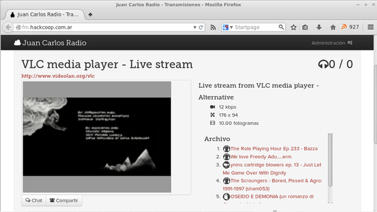

fm.hackcoop.com.ar
==================

Interface multimedia e interactiva en la que se anuncian la lista de estaciones disponibles,
escuchar los programas en vivo, como programas ya emitidos, [chatear](https://github.com/b4zz4/irc.hackcoop.com.ar) con los ollentes 
y buscar contenido en [Internet Archive](https://archive.org). Ver la pagina de la [Desarrollo](http://wiki.hackcoop.com.ar/Categor%C3%ADa:Juan_Carlos_Radio)

Instalación
-----------

~~~
sudo cp -r web/* /etc/icecast2/web/
sudo chown -R icecast2 /etc/icecast2/web/
sudo chgrp -R icecast /etc/icecast2/web/
~~~

Icecast.xml
-----------

### Almacenamiento de programas emitidos

Al terminar cada emisión de radio se hace un archivo del programa y [se comparte](http://fm.hackcoop.com.ar/archive.org.xsl#Realaradio) en Archive.org

~~~
<mount>
   <mount-name>/Realaradio.ogg</mount-name>
   <dump-file>.local/share/icecast2/web/archivo/Realaradio.ogg</dump-file>
   <on-disconnect>.local/share/icecast2/bin/archivar</on-disconnect>
</mount>
~~~

En el ejemplo la estación de radio `/Realaradio.ogg` tiene que cambiar por tu punto de montaje. 
Puede ocurrir que durante microcortes se generen pequeños archivos que hay que borrar a mano :(

### Nombre del que mantiene el icecast

~~~
<admin>moteado@anastasia.local</admin>
~~~

En este caso es una dirección dentro de [LibreVPN](http://librevpn.org.ar), pero podes poner lo que se te ocurra.

Reparando icecast
-----------------

Icecast muchas veces no identifica las salidas con el mimetype adecuado, y conserva cache en el navegador, esto lo reparamos usando esta configuracion de Nginx.

En `fm.hackcoop.com.ar.conf` ponemos:

~~~
server {
  server_name fm.hackcoop.com.ar;
  include "snippets/icecast.conf";
}
~~~

En `snippets/icecast.conf` ponemos:

~~~
index status.xsl;

location / {
  proxy_pass http://localhost:8000;
  proxy_buffering off;
  chunked_transfer_encoding off;
}
~~~

Más detales en [nginx-hackcoop.git](http://repo.hackcoop.com.ar/nginx-hackcoop.git)

Quehaceres
----------

- Generar capturar para el repositorio
- Eliminar archivos muy pequeños (errores) antes de archivarlos
- Anuncio de los archivos archivados de modo local
- Integrar a wordpress feed y comentarios
